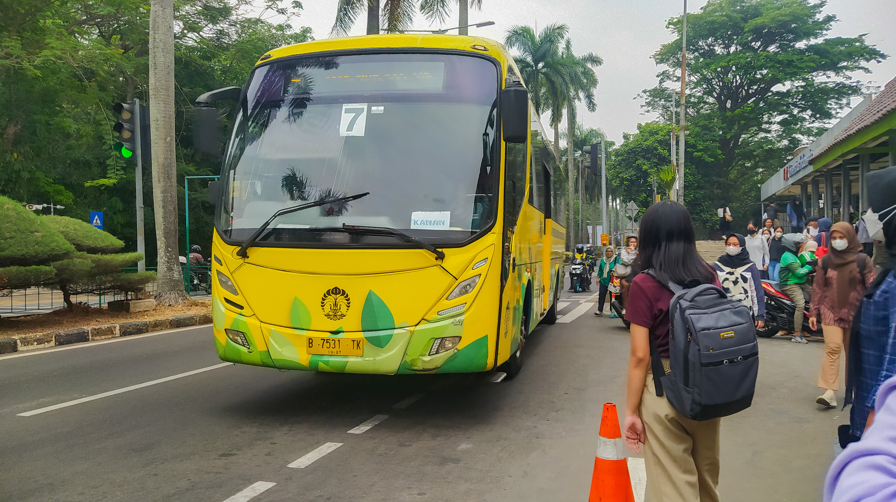
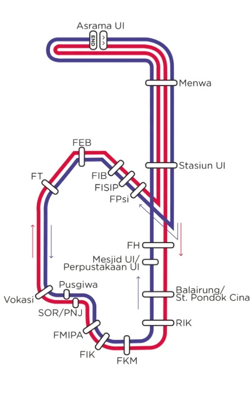
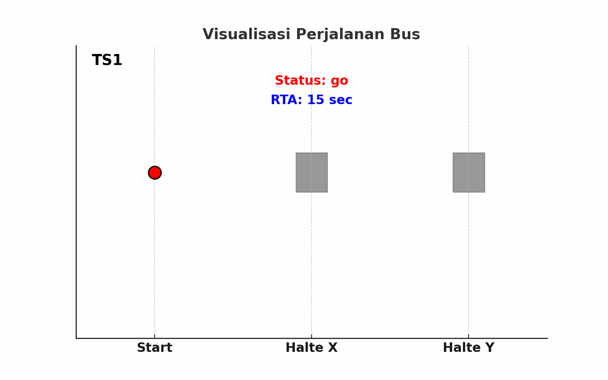

# oprec-ristek

Bus arrival prediction system built from raw GPS data of Universitas Indonesia's Bis Kuning (campus shuttle) without ground-truth labels. Because the dataset intentionally omitted the target variable (Real Time Arrival or RTA), the primary challenge was engineering this target from raw GPS and time series data.

---

## Objective

The goal of this competition was to build a model that predicts how long it takes for Bikun UI to reach the next bus stop — the **Estimated Time of Arrival (ETA)**. The dataset intentionally excluded the Real Time Arrival (RTA) values, so I had to construct the target variable myself from the raw training data before any model could be trained. The test data could only be predicted using a model trained on the training data that already contained the self-constructed RTA.

---

## Dataset Description

The competition data covers the travel history of Bis Kuning (Bikun) at Universitas Indonesia from **September 14, 2024 to September 27, 2024**. The dataset consists of three CSV files and two JSON files.

### train.csv

This is the main training data I used to build and engineer the RTA target variable.

| Column | Description |
|--------|-------------|
| `imei` | Masked IMEI of the device that recorded the data |
| `ts` | Timestamp when the entry was recorded |
| `lat` | Latitude |
| `lon` | Longitude |
| `color` | Route type (`red` for red route, `blue` for blue route) |
| `speed` | Bus speed at the time the entry was recorded |

### test.csv

This is the data I had to generate predictions for. It contains two travel samples, one for each route type (red and blue). All rows belonging to the same route type were recorded by the same device — for example, all red-route test rows share one IMEI, and all blue-route rows share another.

### sample_submission.csv

This file shows the expected submission format.

| Column | Description |
|--------|-------------|
| `id` | Index ensuring a one-to-one correspondence with the `id` in the test data |
| `rta` | Predicted time (in seconds) for the bus to reach the next stop |

### routes.json

This file contains the coordinates (longitude, latitude) of each bus stop per route. I used it to determine which stop the bus was heading toward at any given point.

### jalanraya_ui_flowcoord.json

This file contains the road network coordinates inside the UI campus. I used this file to track the flow of the road, projecting each bus GPS coordinate onto the nearest flow coordinate to get a more accurate sense of the bus's position along the route rather than relying purely on raw GPS from `train.csv`.

---

## RTA Label Construction

Since RTA was not provided, I had to engineer it from scratch. The core rule I applied is that RTA counts down to the next stop, but only reaches 0 at the very last moment before the bus resumes moving — not the instant it arrives. So if the bus arrives at a stop and stays for several entries, only the final entry before departure gets RTA = 0, while the others still carry a positive value. Once the bus departs, RTA resets and begins counting down toward the following stop. I tracked this by monitoring changes in the inferred next stop and the bus status across sequential timestamps.

---

## Solution Approach

### Overview

Because RTA was intentionally removed from the dataset, the core challenge of this project was not the model itself — it was **engineering a reliable target variable from raw GPS and timestamp data**. Once I had a well-constructed RTA, model training became more straightforward.

---

### Data Preprocessing

#### Temporal Filtering

I dropped all entries recorded outside the bus's standard operating hours (before 06:50) and removed segments where the bus stayed stationary for an abnormally long time, as these indicated non-operational periods rather than legitimate stops.

#### Timestamp Alignment

The raw data contained timestamp rollbacks and irregular time patterns caused by multiple IMEI devices recording simultaneously. I identified and corrected these issues to ensure each entry's timestamp was consistent with a single continuous journey.

#### Spatial Cleaning

I applied the DBSCAN clustering algorithm (with `eps=0.0002`) to detect GPS anomalies — for example, coordinates that appeared inside campus buildings rather than on the road. These were removed to prevent them from corrupting the trajectory reconstruction.

#### Segment Correction

Some route segments were misclassified due to GPS noise. I manually corrected these by tracking sequential movements over time, using a 5-minute threshold to distinguish genuine route transitions from noise.

---

### Target Construction (RTA Engineering)

#### Graph-Based Spatial Mapping

I converted the road network from `jalanraya_ui_flowcoord.json` into a coordinate graph. For every bus entry, I projected the GPS coordinate onto the nearest flow coordinate node, then used **Dijkstra's algorithm** to compute the shortest path distance along the road network to the next bus stop. This gave me a spatially accurate measure of where the bus was relative to its next destination.

#### Sequential RTA Reconstruction

To compute the actual RTA values, I relied on sequential tracking. For each entry, I calculated the time difference between the current timestamp and the first timestamp of the bus entering the next route segment. This allowed me to reconstruct the remaining travel time at each point in the journey following the RTA = 0 rule described above.

---

### Modeling

#### Model Selection

I chose **XGBoost Regressor** for this task. The features I fed into the model are:

- **color**: The route type of the bus (red or blue). I included this because the same road segment can behave differently depending on the route — for example, segment 7 on the red route may have a very different travel time profile than segment 7 on the blue route.
- **segment**: The current road segment the bus belongs to, derived from the flow coordinate graph. This tells the model where along the route the bus is at any given moment.
- **distance to next stop**: The graph distance from the bus's current projected position to the next bus stop, computed using Dijkstra's algorithm over the flow coordinate graph.
- **speed**: The bus speed at the time of the entry, as recorded in the raw data.

#### Handling the Campus Forest Route

One edge case I had to handle was a specific morning route where the bus navigates through the campus forest. Normally, a bus of a given color follows a fixed segment-to-segment path — for example, from segment X to segment Y. However, during a specific time window in the morning, the route deviates and goes from segment X into the forest instead. The problem is that the forest coordinates are not present in `jalanraya_ui_flowcoord.json`, so the flow coordinate graph has no nodes covering that area. I handled this by detecting these time-based deviations and applying a separate distance estimation for entries that fell outside the known road network, ensuring the distance feature remained meaningful even when the bus was off the mapped route.
